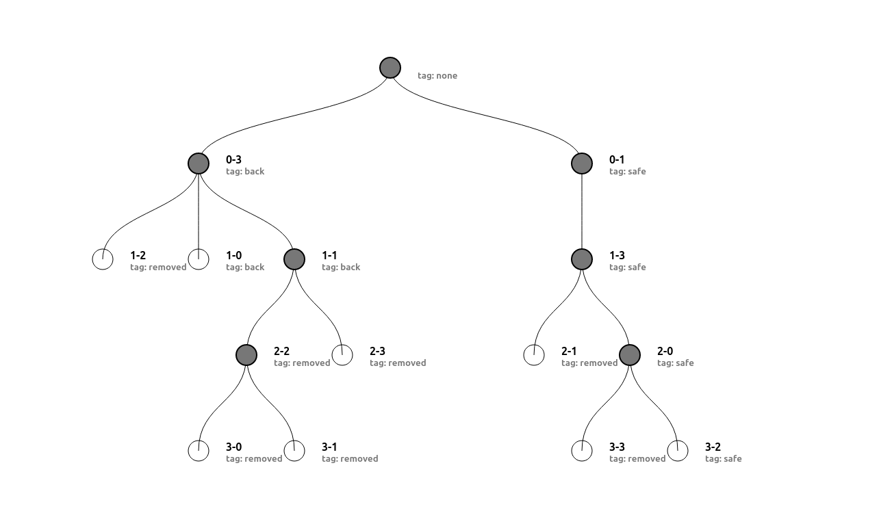

# Algoritmo de las 8 reinas por backtracking

Algoritmo hecho para resolver n reinas y retornando el árbol de ejecución del código.

## Estados
El árbol tiene 4 tipos de tags:
* none - Raíz del árbol
* safe - nodo valido y es el resultados del algoritmo
* remove - nodo eliminado por la función P
* back - nodo no valido y eliminado por la función de backtracking



## Codigo creade en React, empleando Yarn para desplegar

```bash
yarn run start
```

# 8 queens backtracking algorithm

Algorithm made to solve n queens and return the execution tree of the code.

## State
The tree has 4 types of labels:
* none - Tree root
* safe - valid node and is the result of the algorithm
* remove - not removed by function P
* back - invalid and removed by the backtracing function


## Code created in React, using Yarn to display this

```bash
yarn run start
```